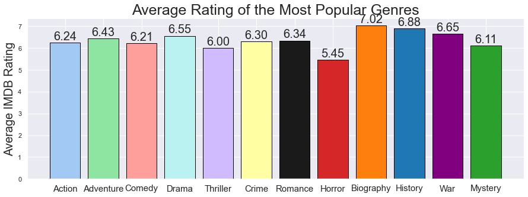
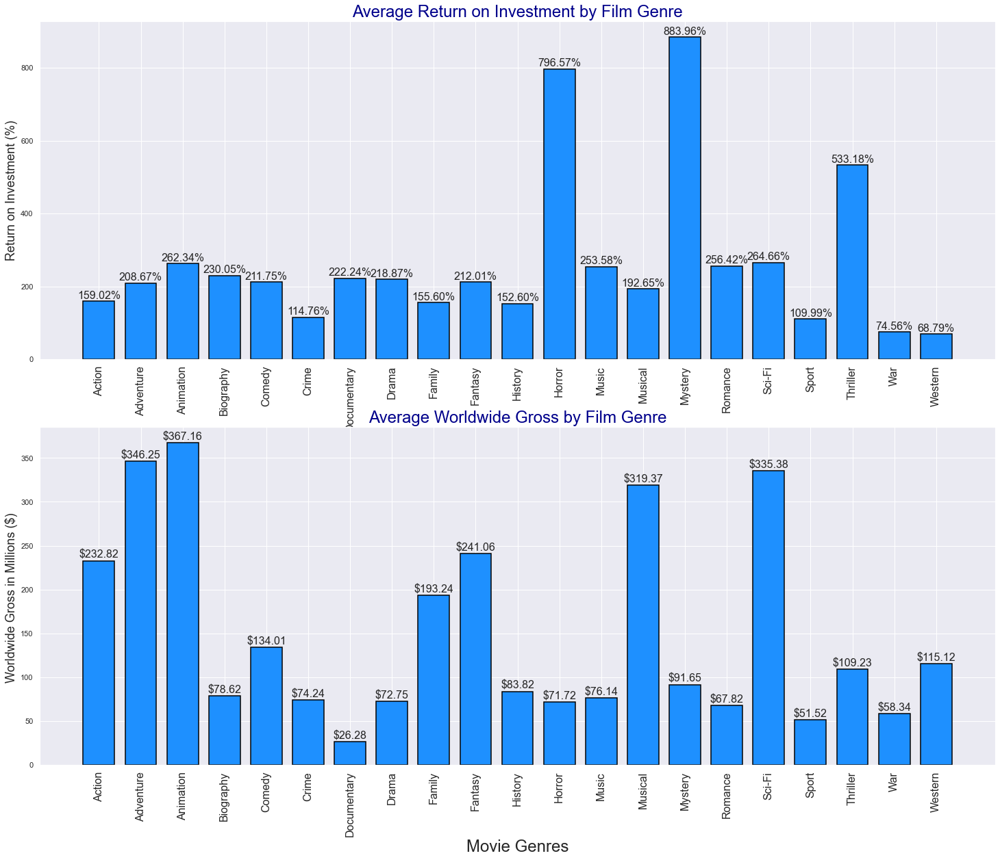
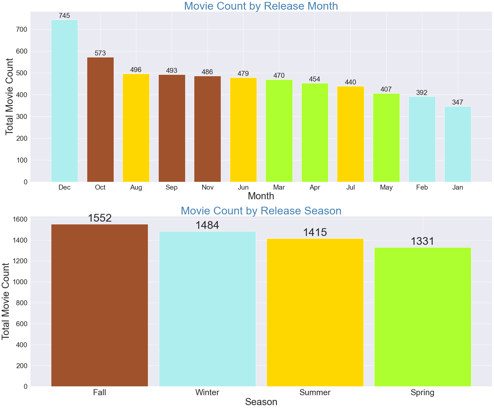
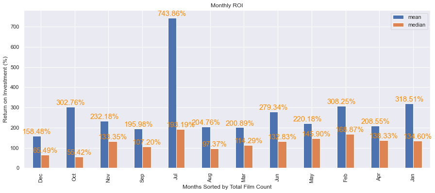
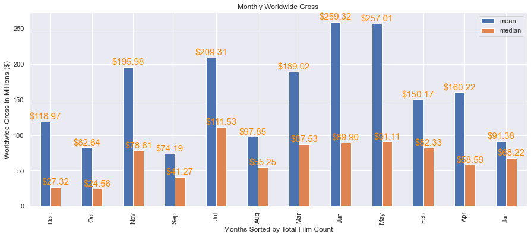

# Microsoft Films Analysis

**Author**: Daniel Tong


## Overview
Using data from The Numbers and IMDB, this project aims to analyze the most successful films for Microsoft's new movie studio. This project seeks to define "success" by examining ratings, popular genres, film lengths, seasonality of movie releases. The findings of this project may help Microsoft approach the ever-expanding film industry.

## Business Problem

Microsoft may be able to find the most financial and critical success through this analysis. By examining film genres, I can identify success by average ratings and average return on investment. I also look into release dates to try to determine the best time to release certain films and any other potential trends.

***

## Data Understanding

IMDB and The numbers are two of the largest databases for publicly sourced movie data. IMDB contains general information, such as genre, release date, cast and crew, on millions of titles. IMDB also has over 80 million registered users contributing their opinions on films via ratings and reviews. The Numbers is a database that tracks box office revenues. 

### IMDB Data

The IMDB dataset has records from films that were released between 2010 and 2019 and basic information like average rating, number of votes, cast, and crew.

### The Numbers Data

The Numbers dataset has information on a film's exat release date, production budget, and gross revenue.

***

## Methods
Using the IMDB dataset, I'm pulling genre, runtime, average ratings, and release year data. Using The Numbers dataset, I'm pulling release date, production budget, and worldwide gross revenue data. I also merge the two datasets to analyze profitability with respect to genres and release dates.

I also separate films with multiple genres into individual entries for each genre listed.
***

## Results
### Average Ratings
Horror is the lowest rated genre with an average of 5.45/10 and Biography/History/War are the highest rated genres with an average of over 7/10. 

### Genre Profitability
Animation and Musicals yield strong revenues but are also big budget productions. These are likely big Disney, Pixar, Dreamworks, etc type blockbusters.
While Horror, on average, is poorly rated, it has one of the highest ROI of almost 800%. Interestingly enough, Horrors don't yield high gross revenues. Their production budget is just so low.

### Seasonality of Film Releases
The least amount of movies are released in Spring. Most movies release in December by a fair margin but Winter is second to Fall for in terms of seasonal count. This is because the least amount of films are released in February and January. This could be due to increases in commercial spending during the holiday season.

The Summer seasons seem to do the best from May to July in both average ROI and worldwide gross. Summer is typically when big budget films come out and aptly named “Summer Blockbusters” are released. There are fairly large gaps between mean and median, this is likely because of those few major box office successes that skew the data.


Mystery, Thriller, and Horror are have the best return on investment because of their low production budget. There are more films of these genres released in October, likely ahead of Halloween. There may also be a slight positive trend in percentage of Horror films made.


***

## Concluding Thoughts
Through this analysis, I have some recommendations regarding genre selection, release date, and film duration for Microsoft's strategy:

#### Financial Success:
* The summer season is the best time to release a big budget blockbuster Adventure/Action film as those films yield some of the largest gross revenues. Also, large budget animated productions. However, competing in this space would require a large amount of risk because of the larger production budgets. 
* Scary movies (Horror, Thriller, Mystery) are typically low budget so the gross revenues aren't as high as other genres. They do have high returns on investments because of the lower budgets and risk. These films are most commonly released during October and around Fall/Halloween.
* Although the most films are released in December, that doesn't yield great results. I believe this to be due to increased competition and that may be why films released in a January, the slowest month, tend to be more commercially successful.

#### Critical Success:
* Longer films appear to translate into more positive reviews. Historical/Biographical films have the highest average ratings and also the longest average runtime, while Horror films have the lowest average ratings and also the shortest average runtime.
* Critical success doesn't necessarily translate to financial success. Historical/Biographical films perform poorly in both ROI and worldwide gross, while Horror films perform extremely well in ROI.

A high risk-high reward route would be competing with other popular high budget Action films in the Summer. 

A safer option would be putting out a shorter and cheaper scary movie. Although it may not be well-received, there's a good chance it's profitable and you make back your money and then some.

Regardless of genre or budget, I don't recommend releasing a film during the Holiday season. I think there is too much risk and little pay off.
***

### Next Steps
One problem that I encountered with the data was merging the datasets. There were a good amount of films that overlapped properly, but there was also a very large amount of films that didn't so my representation may not be sufficient enough. 
* The IMDB data only had film data from 2010 to 2018 and part of 2019. 
* The Numbers data seemed to only have data on larger releases, particularly Western films

To improve my analysis, I would like to get more data. Also, my method of splitting films into a separate entry for each genre may have been flawed and created some issues like skewing data.

I would also like to adjust my methods to account for outliers in a more appropriate manner.

***
The IMDB data can be extracted further and I could apply my same methods in examining actors, directors, writers, and other cast/crew's relationship with genres, ratings, revenues. 

For example, certain actors may be more common in specific genres. This could be potentially useful with casting a successful lead.
## For More Information

Please review my full analysis in [Jupyter Notebook](./microsoft-phase1-project.ipynb) or my [presentation](./Microsoft_Film_Analysis_Presentation.pdf).

For any additional questions, please contact **Dan Tong (dtong136@gmail.com)**

## Repository Structure

```
├── README.md  <- The top-level README for reviewers of this project
├── microsoft-phase1-project.ipynb                   <- Narrative documentation of analysis in Jupyter notebook
├── EDA.ipynb                                        <- Exploratpry Data Analysis in Jupyter notebook
├── Microsoft_Film_Analysis_Presentation.pdf         <- PDF version of project presentation
├── zippedData                                       <- Both sourced externally and generated from code
└── images                                           <- Both sourced externally and generated from code
```
